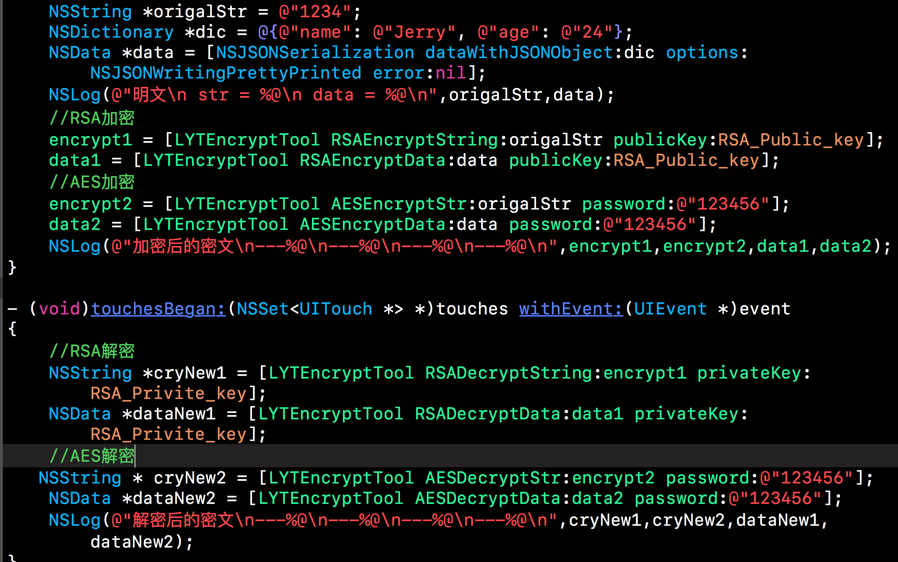
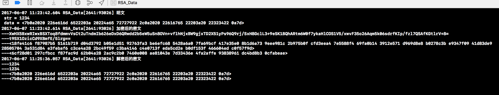

# EncryptTool

## 这个工具用来给数据加密。目前支持RSA／AES加密方式。RSA非对称加密，AES对称加密。 目前测试RSA加密解密速度耗时比较大。AES则好很多。推荐AES方式。RSA加密需要自行申请私钥和公钥对。参见： http://blog.sina.com.cn/s/blog_12c8ae0d80102vy21.html
##接口
```
- (void)viewDidLoad {
[super viewDidLoad];
NSString *origalStr = @"1234";
NSDictionary *dic = @{@"name": @"Jerry", @"age": @"24"};
NSData *data = [NSJSONSerialization dataWithJSONObject:dic options:NSJSONWritingPrettyPrinted error:nil];
NSLog(@"明文\n str = %@\n data = %@\n",origalStr,data);
//RSA加密
encrypt1 = [LYTEncryptTool RSAEncryptString:origalStr publicKey:RSA_Public_key];
data1 = [LYTEncryptTool RSAEncryptData:data publicKey:RSA_Public_key];
//AES加密
encrypt2 = [LYTEncryptTool AESEncryptStr:origalStr password:@"123456"];
data2 = [LYTEncryptTool AESEncryptData:data password:@"123456"];
NSLog(@"加密后的密文\n---%@\n---%@\n---%@\n---%@\n",encrypt1,encrypt2,data1,data2);
}

```
```
- (void)touchesBegan:(NSSet<UITouch *> *)touches withEvent:(UIEvent *)event
{
//RSA解密
NSString *cryNew1 = [LYTEncryptTool RSADecryptString:encrypt1 privateKey:RSA_Privite_key];
NSData *dataNew1 = [LYTEncryptTool RSADecryptData:data1 privateKey:RSA_Privite_key];
//AES解密
NSString * cryNew2 = [LYTEncryptTool AESDecryptStr:encrypt2 password:@"123456"];
NSData *dataNew2 = [LYTEncryptTool AESDecryptData:data2 password:@"123456"];
NSLog(@"解密后的密文\n---%@\n---%@\n---%@\n---%@\n",cryNew1,cryNew2,dataNew1,dataNew2);
}
```
```
#pragma mark - 加密
/**
AES加密
@param password 密码
*/
+ (NSString *)AESEncryptStr:(NSString *)str password:(NSString *)password;
+ (NSData *)AESEncryptData:(NSData *)data password:(NSString *)password;


/**
RSA加密
@param pubKey 公钥
*/
+ (NSString *)RSAEncryptString:(NSString *)str publicKey:(NSString *)pubKey;
+ (NSData *)RSAEncryptData:(NSData *)data publicKey:(NSString *)pubKey;


#pragma mark - 解密
/**
AES解密
@param password 密码
*/
+ (NSString *)AESDecryptStr:(NSString *)base64EncodedString password:(NSString *)password;
+ (NSData *)AESDecryptData:(NSData *)data password:(NSString *)password;

/**
RSA解密
@param str 密文
@param privKey 私钥
@return 明文
*/
+ (NSString *)RSADecryptString:(NSString *)str privateKey:(NSString *)privKey;
+ (NSData *)RSADecryptData:(NSData *)data privateKey:(NSString *)privKey;

```


